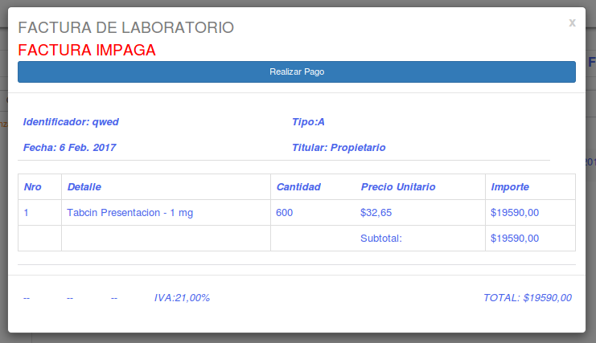
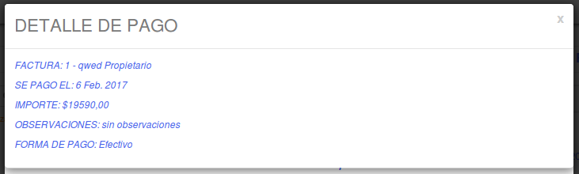

Compras
=======

Si el usuario desea registrar la *Compra de medicamentos a un Laboratorio*, deberá presionar el sub-item ``Compras``.

.. image:: _static/btncompras.png
   :align: center

A continuación el sistema lo redirigirá a la siguiente pantalla:

.. image:: _static/compras.png
   :align: center

En esta pantalla se vera un listado de las *Compras* a ``Laboratorios que aun no esten facturadas``:

.. image:: _static/pantallaCompras1.png
   :align: center

Junto con el listado, se presentarán un conjunto de funcionalidades que permitirán manipular estas *Facturas de Compras*.

Estas funcionalidades son:
   - :ref:`Registrar Factura de Compra <registrar-factura-compra>`
   - :ref:`Ver Facturados <ver-facturados>`
   - :ref:`Cancelar Pago <cancelar-pago>`
   - :ref:`Ver detalle de Pago <ver-detalle-pago>`
   - :ref:`Reportes <reportes>`
   - :ref:`Formulario de Búsqueda Ventas <formulario-busqueda-Ventas>`
   - :ref:`Formulario de Búsqueda Facturas Emitidas <formulario-busqueda-FactEmit>`

.. _generar-factura-compra:

Generar Factura de Compra
-------------------------
Para realizar la factura correspondiente de la *Compra*, debera presionar en el boton de ``Accion``, la pestaña de ``Registrar Factura``.

.. image:: _static/btnAccionRegistrarFactura0.png
   :align: center

Automaticamente se presentara en pantalla un cartel para completarlos datos correspondientes de ``La Factura de Compra``.

.. image:: _static/btnAccionRegistrarFactura2.png
   :align: center

Una vez realizado esto desaparecera la factura donde estaba y se podra ver desde el boton de ``Facturas Generadas``.

.. _ver-facturados:

Ver Facturados
--------------
Para ver las facturas que fueron *Facturadas* debemos presionar en el boton de ``Ver Facturados``.

El mismo, nos conducira a otra pantalla la cual nos mostrara las ``*Facturas Emitidas*``.

En el caso de que no contenga facturas mostrara un mensaje que diga que "LA TABLA ESTA VACIA"

Sino, mostrara las facturas ya emitidas.

En el boton de ``Accion`` encontraremos un submenu con un boton de ``Ver Factura``.

Una vez presionado el boton nos aparecera una pantalla con los datos de la factura en cuestion.

Si queremos realizar el pago debemos presionar el boton de ``Realizar Pago``.

.. image:: _static/btnRealizarPagoCompra.png
   :align: center

Nos aparecera una pantalla para que carguemos la informacion respectiva de la factura:
Tener en cuenta que el sistema corrobora la informacion ingresada

Una vez colocada la informacion respectiva precionamos el boton de ``Pagar``
Y seguido de esto nos aparecera un mensaje de exito.

.. _cancelar-pago:

Cancelar Pago
-------------
Para ``Cancelar Pago`` una vez pagado, debemos presionar el boton de *Cancelar Pago*.

Al presionarlo el sistema mostrara un mensaje de confirmacion.

.. image:: _static/cancelarPagoCompra1.png
   :align: center

.. _ver-detalle-pago:

Ver Detalle de Pago
-------------------
Para Ver el detalle de un pago realizado, debemos presionar el boton de *Ver Pago*.

.. _reportes:

Reportes
--------
Si el usuario desea visualizar y/o generar reportes de estadisticas en relacion a las *Ventas*, debera seleccionar el boton de **Reportes**.

.. image:: _static/reportespedfar.png
   :align: center

Esta funcionalidad cuenta con la modalidad de:

    - :ref:`Top 10 Monto de Compras a Laboratorio <top10-mont-compr-pf>`

 .. _top10-mont-compr-pf:

Top 10 Monto de Compras a Laboratorio
+++++++++++++++++++++++++++++++++++++
Si el usuario desea que los reportes se generen en base al volumen de ventas general, debera presionar la opcion ``Top 10 Monto de Compras a Laboratorio``.

.. image:: _static/top10medspedfar.png
   :align: center

Al hacerlo, se mostrara la siguiente pantalla:

.. image:: _static/pantallatop10medspedfar.png
   :align: center

Si el usuario desea ajustar el rango de fecha sobre el cual se genera el reporte puede hacerlo utilizando la modalidad de filtrado por fechas:
El usuario tendrá que ingresar los parámetros de búsqueda en el formulario, y presionar el botón ``Filtrar``.

.. NOTE::
    Todos los campos son opcionales, de no especificarse ningún criterio de búsqueda el sistema mostrará la informacion historica completa.

.. image:: _static/fechastop10medspedfar.png
   :align: center

Si el usuario desea exportar el resultado generado a una planilla de Excel, debera presionar el ícono de excel.

.. image:: _static/xlstop10medspedfar.png
   :align: center

Si el usuario desea exportar el resultado en un formato de imagen PNG, JPEG, PDF o SVG, debera presionar el boton de herramientas de exportacion y seleccionar la opcion correspondiente.

.. image:: _static/btnexptop10medspedfar.png
   :align: center

.. _formulario-busqueda-Ventas:

Formulario de Búsqueda de Compras
---------------------------------
Si el usuario desea visualizar sólo aquellas *Compras* que cumplan con algunos criterios en específico, deberá utilizar el formulario de búsqueda.

.. image:: _static/formBusqFacturasCompras.png
   :align: center

Este formulario cuenta con dos modalidades:

    - Búsqueda simple: permite buscar las *Compras* por proveedor.
    - Búsqueda avanzada: permite buscar las *Compras* por fechas desde y hasta.

.. NOTE::
    Todos los campos son opcionales, de no especificarse ningún criterio de búsqueda el sistema mostrará todos las *Compras*.

El usuario tendrá que ingresar los parámetros de búsqueda en el formulario, y presionar el botón ``Buscar``. El sistema visualizará aquellas *Compras* que cumplan con todas las condiciones especificadas.

Si el usuario desea limpiar los filtros activos, deberá presionar el boton ``Limpiar``.

.. image:: _static/formBusqFacturasCompras2.png
   :align: center

.. _formulario-busqueda-FactEmit:

Formulario de Búsqueda Facturas Emitidas
----------------------------------------
Si el usuario desea visualizar sólo aquellas *Facturas Emitidas* que cumplan con algunos criterios en específico, deberá utilizar el formulario de búsqueda.

Este formulario cuenta con dos modalidades:

    - Búsqueda simple: permite buscar las *Facturas Emitidas* por proveedor.
    - Búsqueda avanzada: permite buscar las *Facturas Emitidas* por numero de factura, fechas desde y hasta.

.. NOTE::
    Todos los campos son opcionales, de no especificarse ningún criterio de búsqueda el sistema mostrará todos las *Facturas Emitidas*.

El usuario tendrá que ingresar los parámetros de búsqueda en el formulario, y presionar el botón ``Buscar``. El sistema visualizará aquellas *Facturas Emitidas* que cumplan con todas las condiciones especificadas.

Si el usuario desea limpiar los filtros activos, deberá presionar el boton ``Limpiar``.

