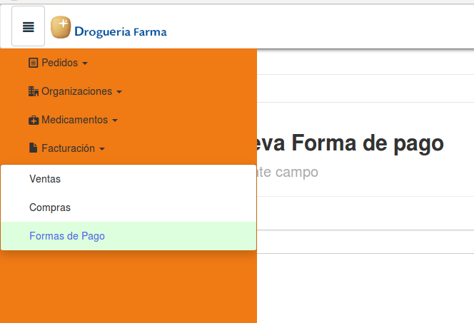
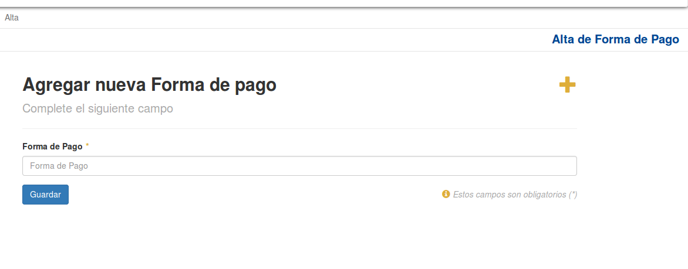

Formas de Pago
===============

Si el usuario desea crear una nueva *Forma de Pago*, deberá presionar el sub-item ``Forma de Pago``.

A continuación el sistema lo redirigirá a la siguiente pantalla:

En esta parte el usuario se le presentará un formulario y deberá ingresar los datos solicitados para dar de alta una nueva *Forma de Pago*.

.. ATTENTION::
    El sistema siempre validará que la información ingresada sea correcta. En caso de que los datos ingresados sean incorrectos el sistema lo informará. 
    En este punto, las posibles causas de errores son:

        - La Forma de Pago ya existe.

Una vez completado el formulario, el usuario tendrá que presionar el boton ``Guardar`` y el sistema se encargará de dar de alta la nueva Forma de Pago.