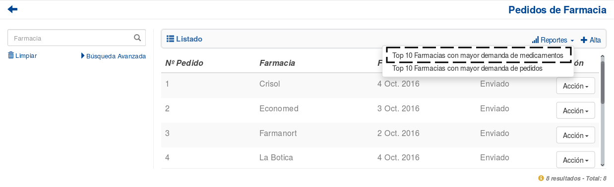
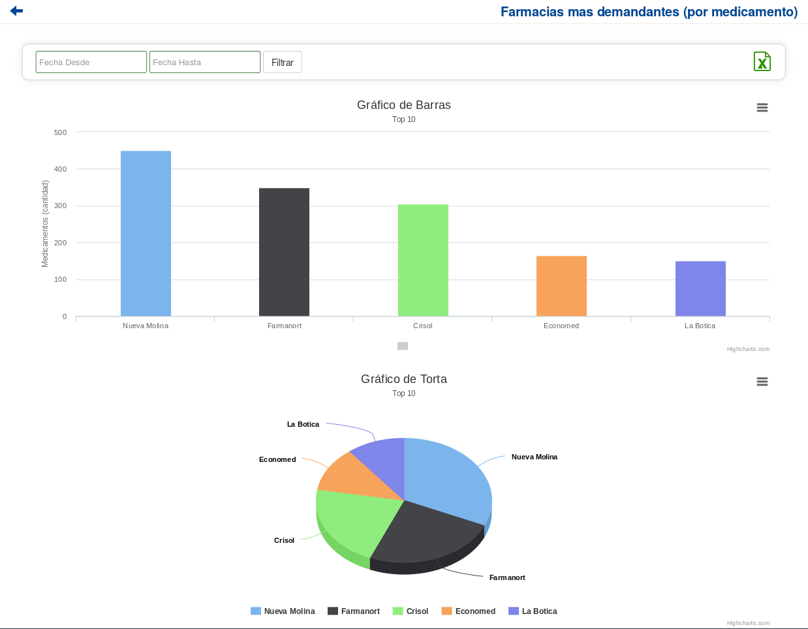
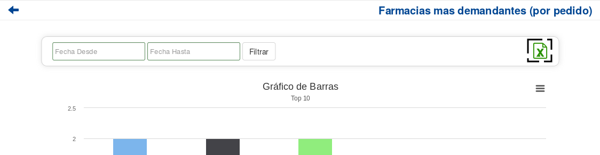
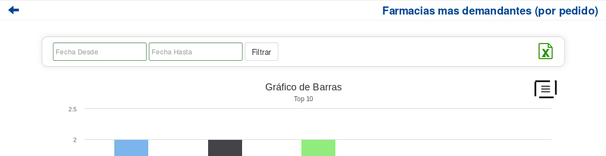

Ventas
======

    EN CONSTRUCCION

Reportes
--------
Si el usuario desea visualizar y/o generar reportes de estadisticas en relacion a las *Ventas*, debera seleccionar el boton de **Reportes**.

.. image:: _static/reportespedfar.png
   :align: center

Esta funcionalidad cuenta con la modalidad de:

    - :ref:`Top 10 Monto Ventas <top10-mont-vtas-pf>`

 .. _top10-mont-vtas-pf:

Top 10 Monto de Ventas
++++++++++++++++++++++
Si el usuario desea que los reportes se generen en base al volumen de ventas general, debera presionar la opcion ``Top 10 Monto de Ventas``.

Al hacerlo, se mostrara la siguiente pantalla:

Si el usuario desea ajustar el rango de fecha sobre el cual se genera el reporte puede hacerlo utilizando la modalidad de filtrado por fechas:
El usuario tendrá que ingresar los parámetros de búsqueda en el formulario, y presionar el botón ``Filtrar``.

.. NOTE::
    Todos los campos son opcionales, de no especificarse ningún criterio de búsqueda el sistema mostrará la informacion historica completa.

.. image:: _static/fechastop10medspedfar.png
   :align: center

Si el usuario desea exportar el resultado generado a una planilla de Excel, debera presionar el ícono de excel.

Si el usuario desea exportar el resultado en un formato de imagen PNG, JPEG, PDF o SVG, debera presionar el boton de herramientas de exportacion y seleccionar la opcion correspondiente.

