Ventas
======

Si el usuario desea registrar la Venta de medicamentos a una Clinica, deberá presionar el sub-item Ventas.

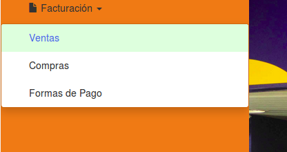

En esta pantalla se vera un listado de las *ventas* a ``clinicas que aun no esten facturadas``:

.. image:: _static/pantallaVentas1.png
   :align: center

Junto con el listado, se presentarán un conjunto de funcionalidades que permitirán manipular estas *Facturas de Ventas*.

Estas funcionalidades son:
   - :ref:`Generar Factura de Venta <generar-factura-venta>`
   - :ref:`Ver Facturas Emitidas <ver-facturas-emit>`
   - :ref:`Imprimir <imprimir>`
   - :ref:`Ver Fecha de Pago <ver-fecha-pago>`
   - :ref:`Registrar Pago <registrar-pago>`
   - :ref:`Reportes <reportes>`
   - :ref:`Formulario de Búsqueda Ventas <formulario-busqueda-Ventas>`
   - :ref:`Formulario de Búsqueda Facturas Emitidas <formulario-busqueda-FactEmit>`
.. _generar-factura-venta:

Generar Factura Venta
---------------------
Para realizar la factura correspondiente de la *Venta*, debera presionar en el boton de ``Accion``, la pestaña de ``Generar Factura``.

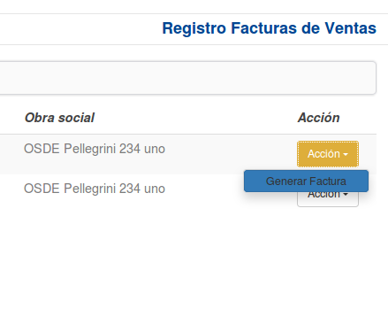

Automaticamente se presentara en pantalla un cartel con el mensaje ``La Factura se genero correctamente``. Y de inmediato desaparecera del listado inicial.

.. image:: _static/btnAccionGenerarFactura.png
   :align: center

.. _ver-facturas-emit:

Ver Facturas Emitidas
---------------------
Para ver las facturas que fueron emitidas debemos presionar en el boton de ``Ver Facturas Emitidas``.

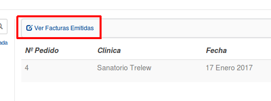

El mismo, nos conducira a otra pantalla la cual nos mostrara las ``*Facturas Emitidas*``.

.. image:: _static/pantallaVerFacturasEmitidas.png
   :align: center

Aqui veremos tanto las facturas ``Pagas`` como las ``Impagas``

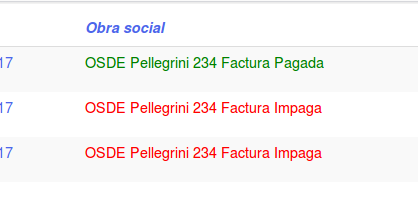

.. _imprimir:

Imprimir
--------
Para *Imprimir* una factura ya Pagada, tenemos que presionar el boton de ``Accion`` y ahi el boton de ``Imprimir``.

.. image:: _static/btnImprimir.png
   :align: center

Nos conducira a la *Factura*, lista para ``Imprimir``.

.. image:: _static/facturaGeneradaPago.png
   :align: center

.. _ver-fecha-pago:

Ver Fecha de Pago
-----------------
Para *Ver la Fecha de Pago*, debemos presionar en el boton de ``Accion`` y ahi el boton de ``Ver Fecha de Pago``.

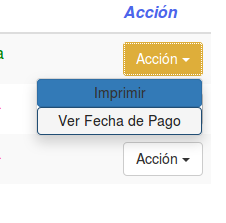

.. _registrar-pago:

Registrar Pago
--------------
A la hora de *Registrar el Pago* debemos presionar sobre la factura que aun no este pagada, el boton de ``Accion`` y ahi el boton de ``Registrar Pago``.

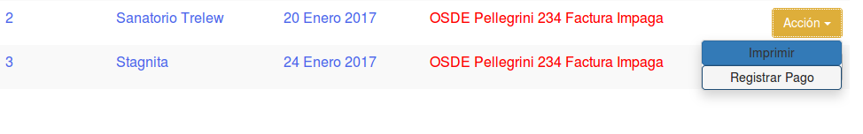

.. image:: _static/cartelElp.png
   :align: center

.. _reportes:

Reportes
--------
Si el usuario desea visualizar y/o generar reportes de estadisticas en relacion a las *Ventas*, debera seleccionar el boton de **Reportes**.

.. image:: _static/reportespedfar.png
   :align: center

Esta funcionalidad cuenta con la modalidad de:

    - :ref:`Top 10 Monto Ventas <top10-mont-vtas-pf>`

 .. _top10-mont-vtas-pf:

Top 10 Monto de Ventas
++++++++++++++++++++++
Si el usuario desea que los reportes se generen en base al volumen de ventas general, debera presionar la opcion ``Top 10 Monto de Ventas``.

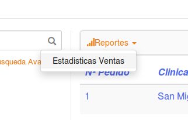

Al hacerlo, se mostrara la siguiente pantalla:

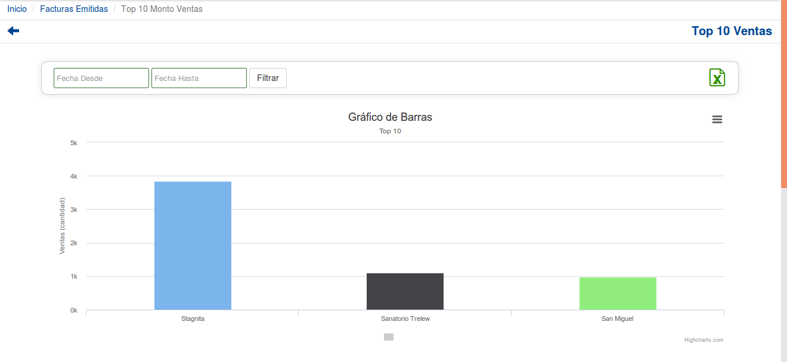

.. image:: _static/top10Ventas2.png
   :align: center

Si el usuario desea ajustar el rango de fecha sobre el cual se genera el reporte puede hacerlo utilizando la modalidad de filtrado por fechas:
El usuario tendrá que ingresar los parámetros de búsqueda en el formulario, y presionar el botón ``Filtrar``.

.. image:: _static/filtroTop10Ventas1.png
   :align: center

Si el usuario desea exportar el resultado generado a una planilla de Excel, debera presionar el ícono de excel.

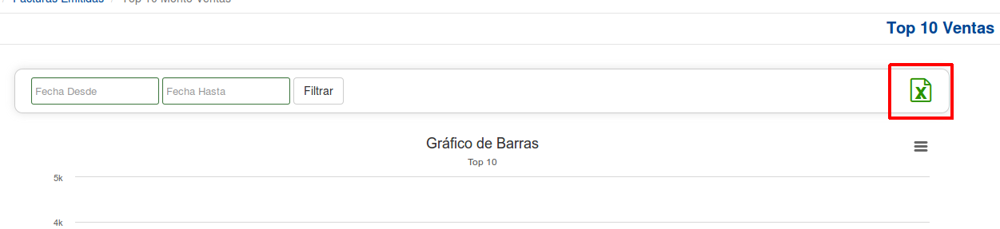

Si el usuario desea exportar el resultado en un formato de imagen PNG, JPEG, PDF o SVG, debera presionar el boton de herramientas de exportacion y seleccionar la opcion correspondiente.

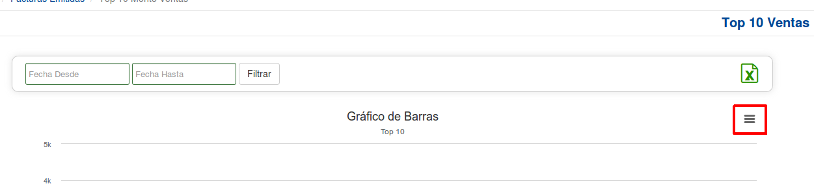

.. _formulario-busqueda-Ventas:

Formulario de Búsqueda de Ventas
--------------------------------
Si el usuario desea visualizar sólo aquellas *Ventas* que cumplan con algunos criterios en específico, deberá utilizar el formulario de búsqueda.

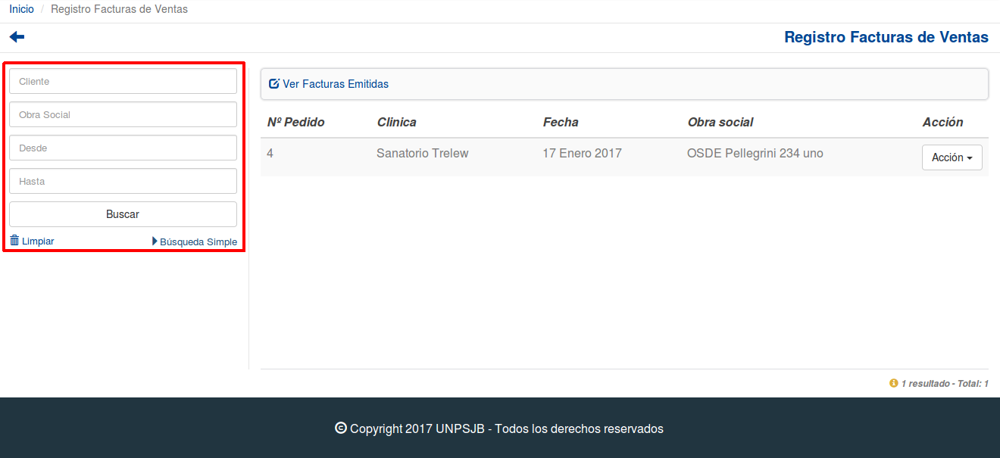

Este formulario cuenta con dos modalidades:

    - Búsqueda simple: permite buscar las *Ventas* por cliente.
    - Búsqueda avanzada: permite buscar las *Ventas* por razon social y fechas desde y hasta.

.. NOTE::
    Todos los campos son opcionales, de no especificarse ningún criterio de búsqueda el sistema mostrará todos las *Ventas*.

El usuario tendrá que ingresar los parámetros de búsqueda en el formulario, y presionar el botón ``Buscar``. El sistema visualizará aquellas *Ventas* que cumplan con todas las condiciones especificadas.

Si el usuario desea limpiar los filtros activos, deberá presionar el boton ``Limpiar``.

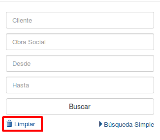

.. _formulario-busqueda-FactEmit:

Formulario de Búsqueda Facturas Emitidas
----------------------------------------
Si el usuario desea visualizar sólo aquellas *Facturas Emitidas* que cumplan con algunos criterios en específico, deberá utilizar el formulario de búsqueda.

.. image:: _static/formBusqFacturasEmitidas.png
   :align: center

Este formulario cuenta con dos modalidades:

    - Búsqueda simple: permite buscar las *Facturas Emitidas* por cliente.
    - Búsqueda avanzada: permite buscar las *Facturas Emitidas* por numero de factura, fechas desde y hasta y tambien por facturas pagas e impagas.

.. NOTE::
    Todos los campos son opcionales, de no especificarse ningún criterio de búsqueda el sistema mostrará todos las *Facturas Emitidas*.

El usuario tendrá que ingresar los parámetros de búsqueda en el formulario, y presionar el botón ``Buscar``. El sistema visualizará aquellas *Facturas Emitidas* que cumplan con todas las condiciones especificadas.

Si el usuario desea limpiar los filtros activos, deberá presionar el boton ``Limpiar``.

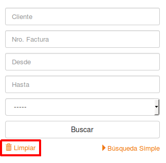